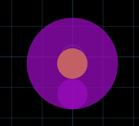
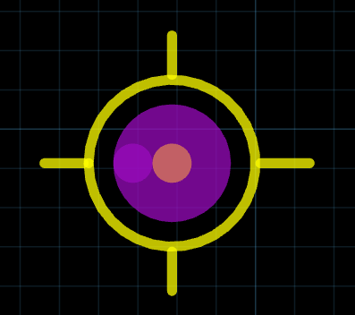
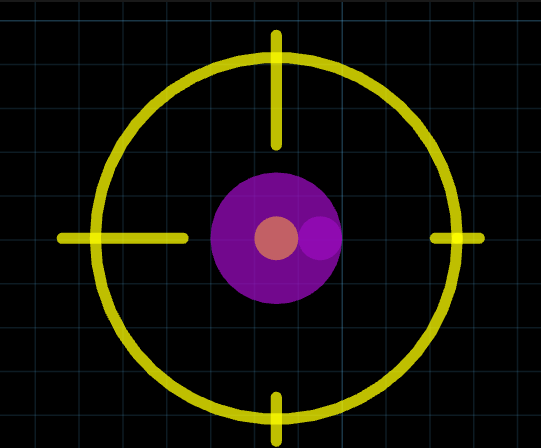

# Trevor's JITX Library
This is a library of helper components that I use in my designs. 

## Fiducials
Basic fiducials can be generated by using the helper pcb-components in the library.   
To use these, `import trevlib/components/fiducial`   
  
Then fiducials can be created as components. 
```stanza
    inst f-1mm : fiducial-1mm
```



```stanza
    inst f-crosshair : fiducial-crosshair(
        1.0   ; Pad Size
        1.0   ; Exclusion Radius
        2.0   ; Crosshair Radius
        0.254 ; Crosshair line Size
        true  ; Enable Crosshair circle
        true  ; Enable Crosshair north line
        0.0   ; Crosshair north line offset
        1.0   ; Corsshair north line length
        true  ; Enable Crosshair south line
        0.0   ; Crosshair south line offset
        1.0   ; Corsshair south line length
        true  ; Enable Crosshair east line
        0.0   ; Crosshair east line offset
        1.0   ; Corsshair east line length
        true  ; Enable Crosshair west line
        0.0   ; Crosshair west line offset
        1.0   ; Corsshair west line length
    )
```



```stanza
    inst f-opulo : fiducial-crosshair(
        1.0   ; Pad Size
        1.0   ; Exclusion Radius
        4.0   ; Crosshair Radius
        0.254 ; Crosshair line Size
        true  ; Enable Crosshair circle
        true  ; Enable Crosshair north line
        -2.0 - (0.254 / 2.0)   ; Crosshair north line offset
        2.5   ; Corsshair north line length
        true  ; Enable Crosshair south line
        -0.5 - (0.254 / 2.0)   ; Crosshair south line offset
        1.0   ; Corsshair south line length
        true  ; Enable Crosshair east line
        -0.5 - (0.254 / 2.0)   ; Crosshair east line offset
        1.0   ; Corsshair east line length
        true  ; Enable Crosshair west line
        -2.0 - (0.254 / 2.0)   ; Crosshair west line offset
        2.5   ; Corsshair west line length
    )
```

  
  

The library defines the following components:
`public pcb-component fiducial-1mm`  
`public pcb-component fiducial-2_5mm`  
`public pcb-component fiducial (padSize:Double = 1.0, exclusionRadius:Double = 1.0)`  
```stanza
public pcb-component fiducial-crosshair (
  padSize:Double = 1.0
  exclusionRadius:Double = 1.0
  crosshairRadius:Double = exclusionRadius + 1.0
  crosshairLineSize:Double = 0.254
  crosshairCircle:True|False = true
  crosshairNorth:True|False = true
  crosshairNorthOffset:Double = 0.0
  crosshairNorthLen:Double = 1.0
  crosshairSouth:True|False = true
  crosshairSouthOffset:Double = 0.0
  crosshairSouthLen:Double = 1.0
  crosshairEast:True|False = true
  crosshairEastOffset:Double = 0.0
  crosshairEastLen:Double = 1.0
  crosshairWest:True|False = true
  crosshairWestOffset:Double = 0.0
  crosshairWestLen:Double = 1.0
  )
```